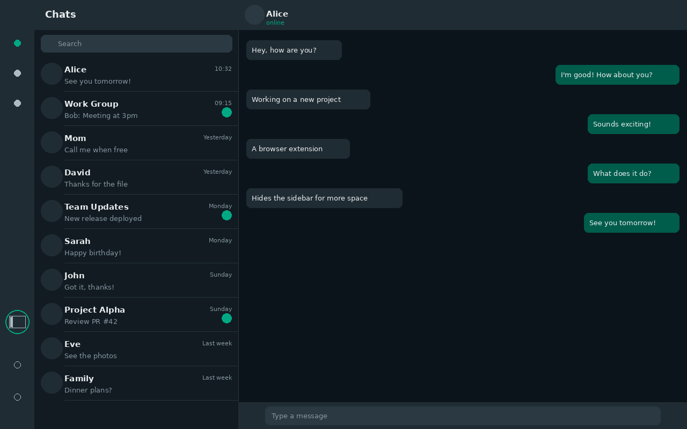
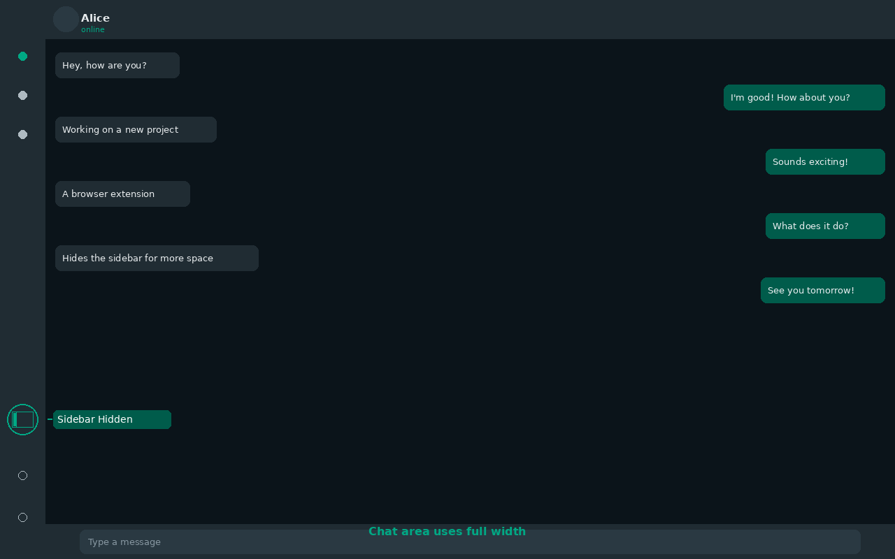

# WhatsApp Web Sidebar Toggle

A minimal browser extension that adds a toggle button to hide/show the left sidebar in WhatsApp Web, giving you more screen space for conversations.





## Features

- **Toggle button** in the left navigation bar
- **Keyboard shortcut** — `Ctrl+B` (`Cmd+B` on Mac)
- **Remembers your preference** across sessions via `localStorage`
- **Smooth animation** when collapsing/expanding
- **Zero permissions** — no data collection, no background scripts

## Installation

### Chrome Web Store

*Coming soon*

### Manual (Developer Mode)

1. Clone or download this repository
2. Open `chrome://extensions` in your browser
3. Enable **Developer mode** (top right)
4. Click **Load unpacked** and select the project folder
5. Open [web.whatsapp.com](https://web.whatsapp.com)

Works on Chrome, Brave, Edge, and other Chromium-based browsers.

## How It Works

The extension injects a content script into WhatsApp Web that:

1. Waits for the DOM to load using a `MutationObserver`
2. Locates the sidebar via the stable `#side` element
3. Injects a toggle button into the navigation header (`header[data-tab]`)
4. Toggles visibility by adding/removing CSS classes
5. Persists the sidebar state in `localStorage`

## Project Structure

```
├── manifest.json   # Extension manifest (Manifest V3)
├── content.js      # Toggle logic, DOM handling, keyboard shortcut
├── styles.css      # Sidebar animation and button styles
└── icons/
    ├── icon16.png
    ├── icon48.png
    └── icon128.png
```

## Selector Strategy

WhatsApp Web uses obfuscated CSS class names that change between deployments. This extension avoids relying on them by using:

- `#side` — stable element ID for the chat list
- `header[data-tab="2"]` — stable attribute for the navigation header
- Parent/child traversal from known anchors

## Contributing

Contributions are welcome! Feel free to open an issue or submit a pull request.

## License

[MIT](LICENSE)
